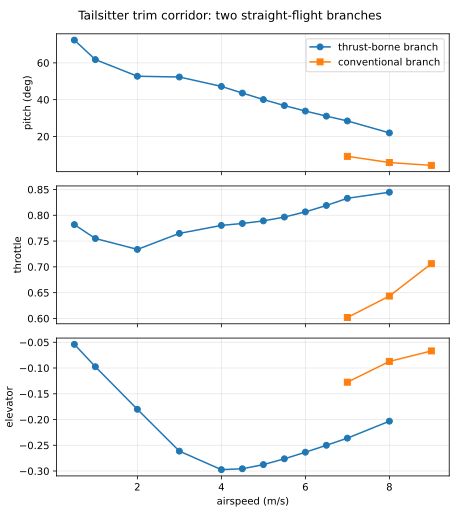
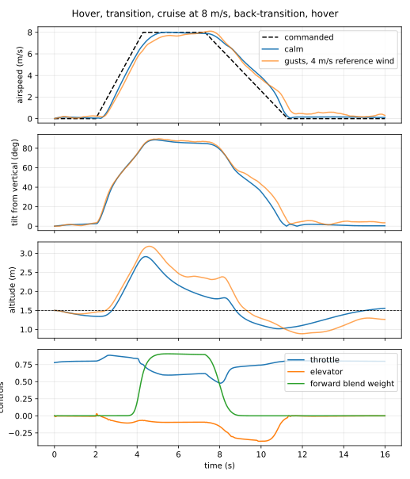

# The tailsitter reference

`cascade.tailsitter_reference()` is an illustrative indoor-class twin-motor flying-wing
tailsitter: 100 g, 0.5 m span, two counter-rotating 0.1 m propellers on the leading edge, elevons
spanning the trailing edge, tip winglets. It is a software fixture built to exercise the regime
Cascade exists for, hover-to-cruise transition through post-stall flight, not an identified
vehicle. Its numbers are plausible for a 1S micro airframe.

## What makes it a tailsitter in the model

- Each propeller's wake is mapped onto its own inboard wing panel (far-wake weight 1.8) and
  grazes its winglet; the outboard panels are clean. A 0.1 m propeller washes about 40% of a
  0.25 m half-span, and applying the wake to the whole half would let propwash lift carry most
  of the weight and trim the near-hover state at only 44° of pitch.
- The elevons are flaps on every wing panel, so in hover the washed inboard panels give pitch
  and roll authority at zero airspeed: about half deflection yields several rad/s² about both
  axes from propwash alone.
- Differential thrust yaws in body axes; the counter-rotating pair leaves no net reaction torque.
- Hover needs about 78% throttle; full throttle gives a thrust-to-weight ratio of 1.6.

## The steady transition corridor

`examples/tailsitter_corridor.py` traces the two straight-flight branches with
`continue_trims`. The conventional branch exists above the fixture's stall speed of about
7 m/s (alpha 4° at 9 m/s to 9° at 7 m/s). The thrust-borne branch continues from near hover
all the way up through cruise as a pure pitch branch, with no roll or sideslip:

| airspeed m/s | 0.5 | 1 | 2 | 3 | 4 | 5 | 6 | 7 | 8 |
| --- | ---: | ---: | ---: | ---: | ---: | ---: | ---: | ---: | ---: |
| pitch = alpha ° | 72 | 62 | 53 | 52 | 47 | 40 | 34 | 28 | 22 |
| throttle | 0.78 | 0.76 | 0.73 | 0.77 | 0.78 | 0.79 | 0.81 | 0.83 | 0.85 |
| elevator (normalized) | −0.05 | −0.10 | −0.18 | −0.26 | −0.30 | −0.29 | −0.26 | −0.24 | −0.20 |

Two features matter for a transition controller. The branches coexist above 7 m/s with very
different incidence, so a transition is a change of branch, not a slide along one. And between
3 and 5 m/s the thrust-borne branch needs the most nose-up elevon: that is the
control-authority pinch where the wings are fully separated and the propwash over the inboard
elevons carries the pitch authority.

The pinch is where the model's post-stall flap moment matters. With the separated flap load
lumped at the panel quarter chord (no moment arm) the branch above 3 m/s only balanced by
rolling to 28° and sideslipping 26°, and full nose-up elevon could not hold alpha beyond 30° at
7 m/s, so no back-transition was flyable. Giving the separated flap load the arm the attached
flap moment implies (`docs/architecture.md`) removes that barrier: full elevon now pitches the
wing up through 90° alpha at 7 m/s.

## Hover and transition under closed-loop control

`cascade.vtol` flies the fixture with the loops in `cascade.control`: hover guidance turns a
position and velocity error into a thrust axis and throttle (with an integral so the wing's
camber lift in its own propwash leaves no standing offset, a wing-lift credit so a fast, tilted
wing is not pushed forward by thrust it no longer needs, and a position-error clip so the loop
tracks velocity rather than lunging at a stale position), the attitude and rate loops track
that axis, and a transition is a scheduled forward tilt proportional to the commanded speed.
The forward-flight guidance blends in when both the measured airspeed and the commanded speed
are above the switch, so decelerating the schedule hands the aircraft back to hover guidance
while it is still fast: the back-transition is a pitch-up onto the thrust-borne branch that
lets drag do the braking. `examples/tailsitter_transition.py` flies the round trip, hold 2 s,
3.5 m/s² to 8 m/s, 3 s of cruise, 2 m/s² back to hover:

| time s | 2 | 3 | 4 | 5 | 7 | 8 | 9 | 10 | 11 | 12 | 15 |
| --- | ---: | ---: | ---: | ---: | ---: | ---: | ---: | ---: | ---: | ---: | ---: |
| commanded m/s | 0 | 3.5 | 7.0 | 8.0 | 8.0 | 6.6 | 4.6 | 2.6 | 0.6 | 0 | 0 |
| airspeed m/s | 0.1 | 2.4 | 6.0 | 7.9 | 7.9 | 7.3 | 5.6 | 3.9 | 1.1 | 0.2 | 0.1 |
| tilt from vertical ° | 2.5 | 48 | 74 | 88 | 85 | 79 | 52 | 35 | 4 | 1.4 | 0.4 |
| forward weight | 0 | 0 | 0.20 | 0.90 | 0.90 | 0.45 | 0 | 0 | 0 | 0 | 0 |
| throttle | 0.80 | 0.88 | 0.84 | 0.62 | 0.62 | 0.48 | 0.72 | 0.74 | 0.80 | 0.81 | 0.80 |
| altitude m | 1.34 | 1.67 | 2.69 | 2.65 | 1.92 | 1.81 | 1.37 | 1.11 | 1.02 | 1.11 | 1.50 |

The elevon never passes 0.4 of its travel. The whole rollout is one differentiable program, so
the ramp rates, the tilt schedule, or any gain can be tuned by gradient through both
transitions.

A heading profile in the same schedule turns the aircraft in cruise: a 90° ramp over 3 s is
tracked with about a second of lag at 20° of bank, holds altitude within 0.3 m through the
turn, and the back-transition then lands a hover facing the new heading within 0.15 m of the
setpoint. Two details make that clean. The forward rate setpoint carries the coordinated-turn
pitch and yaw rates for the commanded bank (`cascade.control.coordinated_turn_rates`); without
them the differential-thrust yaw loop fought the turn with an 0.08 throttle split and the nose
dropped 0.9 m. And the hover azimuth at the end is the final heading, so the wing is already
facing the way the next transition will go.

## Tuning the schedule by gradient

`examples/tailsitter_tuning.py` differentiates a cost over the whole 16 s round trip (mean
squared altitude error, final position and speed error, elevon effort) with respect to the
schedule's acceleration, deceleration, and cruise tilt, and takes a dozen bounded gradient
steps. After a 7 s compile each value-and-gradient of the full flight takes about 0.2 s. The
gradient's advice is consistent from the first step: accelerate harder (3.5 to 4.0 m/s²), tilt
more at cruise (1.0 to 1.16 rad), brake a little gentler (2.0 to 1.7 m/s²), and the cost falls
from 0.40 to 0.28 with the altitude term doing most of it. That is the differentiability claim
exercised end to end: plant, actuators, stall dynamics, and every loop of the controller.

## Wind and gusts

`transition_rollout(..., environments=)` takes a time-major environment, so a Dryden sequence
from `cascade.gusts` runs through both transitions. Three things the wind cases taught:

- **Hover yaw is differential thrust.** In hover the body z axis is the belly normal, and the
  elevons have no authority about it. A 1 m/s spanwise wind weathervanes the wing about that
  axis through the winglets and, with nothing to hold it, tips the thrust axis over within
  seconds. `TransitionController.differential_thrust` maps the rate loop's body-z command onto
  the two motors (±0.5 throttle per unit command on the fixture); with it the same wind is held
  to 0.2 m and the propellers split by a few percent.
- **Hover edge-on to the wind.** A 0.1 kg wing on 0.075 m² is a very light flat plate: a 2 m/s
  wind broadside to the wing is 40% of its weight, and leaning into the wind exposes more
  plate, so with the belly facing a 2 m/s wind the hover drifts downwind at about 1 m/s
  whatever the tilt limit. With the span into the same wind (belly across it) the hover holds
  to 0.4 m. Choosing the hover azimuth across the wind is the fixture's wind strategy, as it is
  for real tailsitters.
- **Gusts are survivable.** Low-altitude Dryden turbulence for 2 and 4 m/s reference winds
  (rms 0.4 to 0.75 m/s along track at 1.5 m) leaves the calm-air round trip finite, within its
  altitude band, and back in a hover within a few metres of the setpoint, without a mean wind.

The figures come from `scripts/plot_tailsitter.py` (run with `uv run --with matplotlib`).
